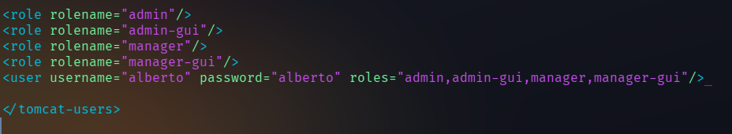
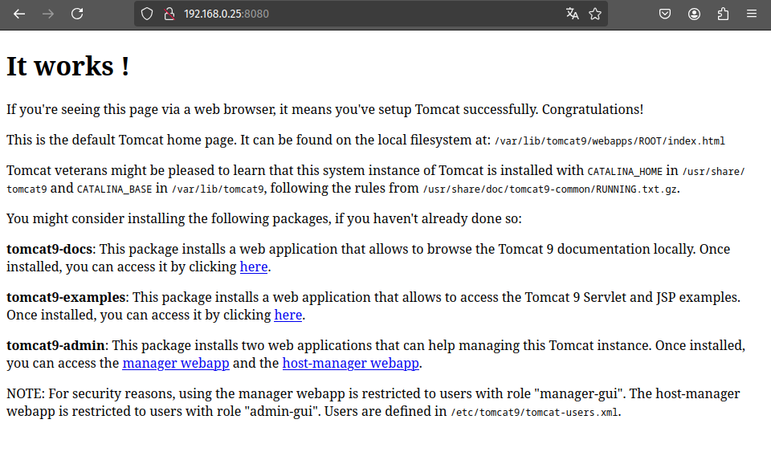
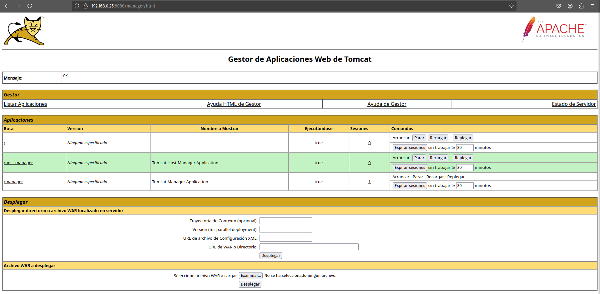
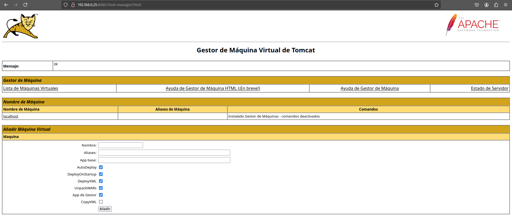
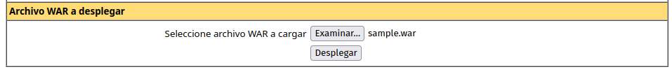
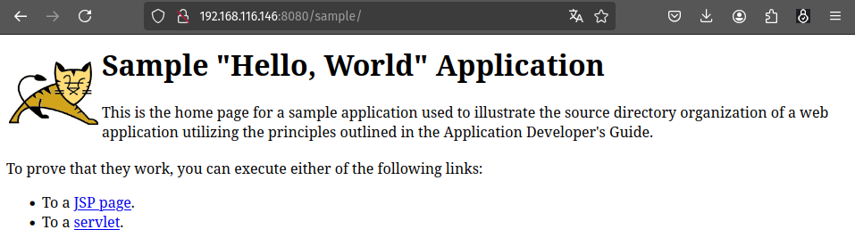
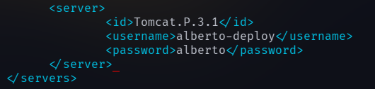
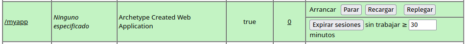
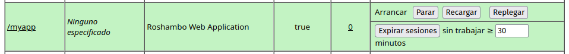
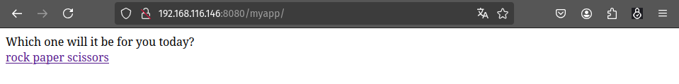

# Unidad 3 - Práctica 1. Instalación de Tomcat y Mava para despliegue de aplicación Java

Para la realización de esta práctica es necesario como prerequisito la instalación 
de una máquina virtual con Debian 11 "Bullseye". También es apropiado descargar, 
instalar y configurar herramientas útiles como **ufw** y **openssh-server**, que además 
de ser útiles en el trabajo con máquinas que actúan como servidores, serán necesarias 
para conectar mediante SSH a nuestra máquina anfitriona con la máquina virtual.

# Instalación y configuración de Tomcat

Permitimos la escucha a través del puerto 8080 (es el puerto que Tomcat usa por defecto): 

```console
sudo ufw allow 8080
```

Instalamos Java y Tomcat:

```console
sudo apt install openjdk-11-jdk
sudo apt install tomcat9
```

Creamos un grupo y usuario específicos para Tomcat en nuestra máquina e iniciamos el 
servicio:
```console
sudo groupadd tomcat9;
sudo useradd -s /bin/false -g tomcat9 -d /etc/tomcat9 tomcat9;

sudo systemctl start tomcat9;
```

A continuación será preciso modificar el archivo /etc/tomcat9/tomcat-users.xml, 
agregando las siguientes líneas para añadir a un usuario administrador a Tomcat: 



A continuación podemos acceder a Tomcat desde el puerto 8080 de la IP de la MV 
(en mi caso, 192.168.0.25:8080): 



Ahora debemos instalar el paquete 'tomcat9-admin', que se encarga de administrar 
las aplicaciones web de Tomcat:

```console
sudo apt install tomcat9-admin
```

Y podremos acceder al gestor de aplicaciones web indicando el nombre y clave de 
usuarios que anteriormente añadimos a la configuración de Tomcat en la MV. Esta 
vez, es necesario indicar que accedemos al recurso alojado en /manager/html (
es decir, 192.168.0.25:8080/manager/html, en mi caso particular):



También podemos acceder al gestor de MV de Tomcat indicando igualmente usuario 
y clave (esta vez desde 192.168.0.25:8080/host-manager/html):




# Despliegue con Tomcat

Una vez configurado Tomcat, podemos desplegar una aplicación indicando un archivo 
con extensión '.war': 



Ahora, en el apartado "Aplicaciones", podremos encontrar la aplicación que hemos 
desplegado y acceder a ella desde la ruta que viene indicada. En mi caso, la 
aplicación se encuentra en '/sample'. Accediendo a ella: 




# Instalación y configuración de Maven

Para instalar Maven sólo hace falta ejecutar:

```console
sudo apt install maven
```

Ahora tendremos que volver a modificar el archivo de configuración 
'/etc/tomcat9/tomcat-users.xml' para añadir el rol de 'manager-script' y un nuevo 
usuario con tal rol, que debe ser diferente al usuario que ya habíamos creado en 
la instalación y configuración de Tomcat. En mi caso, el archivo ha quedado tal que:


Además, también tendremos que especificar esta información en el archivo de configuración 
/etc/maven/settings.xml, dentro del bloque 'servers':




# Despliegue con Maven

## Aplicación de prueba

Para realizar el despliegue, utilizaré una aplicación de prueba en primer lugar. Primero, 
ejecuto:
```console
mvn archetype:generate -DgroupId=alberto -DartifactId=aplicacion-prueba -DarchetypeArtifactId=maven-archetype-webapp -DinteractiveMode=false
```

Ahora, en el proyecto del directorio 'aplicacion-prueba/' que hemos generado, modificamos 
el archivo 'pom.xml'. En el bloque 'build' se añaden las siguientes líneas: 

```xml
<build>
        <finalName>aplicacion-prueba</finalName> 
        <plugins> 
	        <plugin>
        		<groupId>org.apache.tomcat.maven</groupId>
		        <artifactId>tomcat7-maven-plugin</artifactId>
		        <version>2.2</version>
		        <configuration>
				<url>http://localhost:8080/manager/text</url> 
				<server>Tomcat.P.3.1</server> 
				<path>/myapp</path> 
		        </configuration>
	        </plugin>
        </plugins>
</build>
```

Tras lo cual ejecutamos:

```console
mvn tomcat7:deploy
```
Y si todo está correcto, Maven debe arrojar un mensaje "BUILD SUCCESS". Al volver a 
Tomcat ("ip_servidor:8080/manager" si accedemos desde la máquina anfitriona o 
"localhost:8080/manager" si accedemos desde la MV del servidor), encontraremos nuestra 
aplicación desplegada:




## Despliegue de aplicación Java

Ahora que hemos comprobado que el despliegue puede realizarse correctamente sin errores, 
podemos realizar el despliegue de una aplicación real de Java. Para ello, podemos clonar 
una aplicación desde GitHub con:

```console
git clone https://github.com/cameronmcnz/rock-paper-scissors.git
git checkout patch-1
# En el caso de este proyecto, debemos posicionarnos en la rama 'patch-1'
```

De nuevo, modificamos el archivo 'pom.xml' y le agregamos el mismo bloque 'plugin' del 
caso anterior. Volvemos a ejecutar el despliegue y si entramos a Tomcat podremos 
encontrar la aplicación lista:



Y podremos acceder desde la ruta a la aplicación:




# Cuestiones finales

Las contraseñas que maneja Tomcat se almacenan como texto plano ya que para el acceso a bases de datos, 
Tomcat necesita las contraseñas originales. Incluso si la contraseña fuese encriptada, como Tomcat es 
de código abierto, un posible atacante conocerá los métodos de encriptación y desencriptación de Tomcat, 
por lo que no existiría una seguridad efectiva en este sentido.
